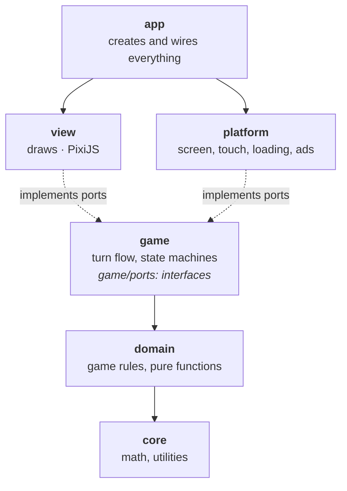
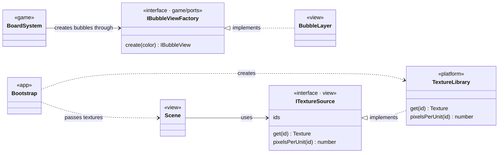
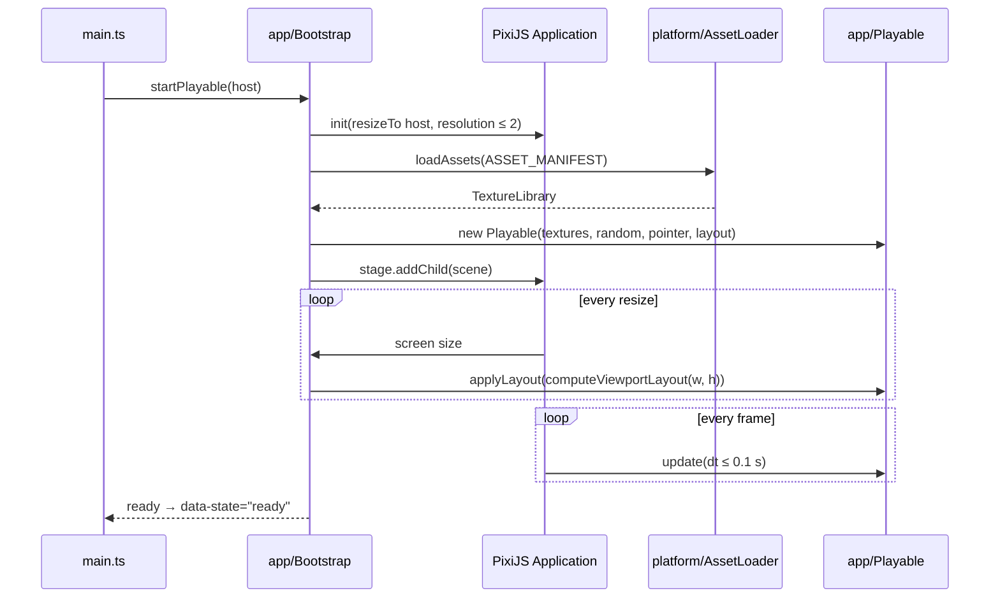
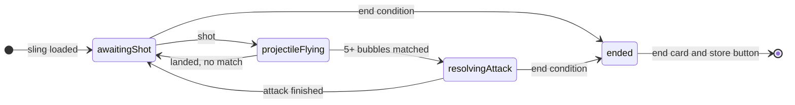
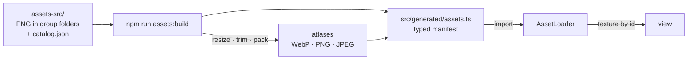
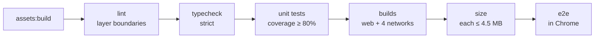

# Bubble Playable

A bubble shooter playable ad built with **TypeScript + PixiJS 8**. The build output is **a single `index.html`** of at most 4.5 MB that is uploaded to ad networks.

> The art and font (`assets-src/`) belong to third parties and are not part of this repository. Without that folder the code can be read but the game cannot be built.

| Stage | Scope | Status |
|---|---|---|
| P0 | Scaffold, asset pipeline, quality gates | ✅ |
| P1 | Game rules without graphics: grid, matches, projectile physics | ✅ |
| P2 | Scene and layout for any screen | ✅ |
| P3 | Bubble board | ✅ |
| P4 | Sling, shot, flight, landing | ✅ |
| P5 | Attack: bubbles fly into the orb, the orb hits the enemy, effects | ✅ |
| P6 | Ad networks, end card, builds | ✅ |
| P7 | Performance, QA | ⏳ |

---

## Architecture

### Layers

The code is split into layers. **A layer may only depend on the layers below it.** Game rules know nothing about PixiJS, and graphics make no decisions.



Arrows show the nearest neighbour. Each layer may also use everything further down the diagram, never anything above:

| Layer | Knows about | Does not know about |
|---|---|---|
| `core` | — | everything else, PixiJS, the browser |
| `domain` | `core` | `game`, `view`, `platform`, PixiJS, the browser |
| `game` | `domain`, `core` | `view`, `platform`, PixiJS, the browser |
| `view` | `game/ports`, `domain`, `core`, PixiJS | `platform`, `app` |
| `platform` | `game/ports`, `core`, the browser | `view`, `app`, PixiJS (except asset loading) |
| `app` | everything | — |

**How it stays clean.** The table above is enforced, not agreed on. A custom ESLint rule, `layers/dependency-direction` ([tools/eslint/layer-rule.js](tools/eslint/layer-rule.js)), fails `npm run verify` on any import in the wrong direction. `core`, `domain` and `game` are also barred from browser globals (`window`, `document`, `fetch`, `setTimeout`…) and from `async`/`await`: game logic is explicit state machines updated every frame.

### Ports and adapters

When a layer needs something from a neighbour, it does not import it; it **declares an interface** (a port). The neighbour implements it and `app` wires them together. Dependencies always point one way, and any part can be replaced with a fake in tests.



### Startup



### Camera and layout

The whole world is drawn inside one container, `WorldStage`, whose transform is the camera: children live in **world units with Y up**, and the container maps them to screen pixels. Positions and sizes carry over from the original design without conversion.

`computeViewportLayout` (a pure function in `domain/layout`) works out what is visible for a screen size:

| Screen | What happens |
|---|---|
| reference 1125×2436 | exactly the design area is visible |
| phone taller than the reference | more height is visible, the board keeps its width |
| tablet in portrait | more is visible at the sides, the board keeps the reference width |
| landscape | a reference-aspect strip in the centre, black bars at the sides |

### Turn flow

Every system is an explicit state machine. Data lives inside the state that needs it, so impossible combinations cannot even be written. Systems do not know each other: the `TurnFlow` mediator polls input every frame and moves the turn forward.

| System | States | What it does |
|---|---|---|
| `LauncherSystem` | `empty → ready → aiming` | grabs the bubble, limits the pull to a ±40° cone, shoots opposite to the pull |
| `BoardSystem` | a shot in flight or not | accelerated flight, wall bounces, landing on the nearest free cell, impact ripple, matches |
| `MatchAttackSequence` | per bubble `waiting → popping → flying → shrinking → done`; orb `gathering → orbFlying → orbHit` | pops matched bubbles in a stagger, arcs them into the orb, flies the charged orb into the enemy |
| `TurnFlow` | `awaitingShot → projectileFlying → resolvingAttack → ending → ended` | loads the sling, starts the flight, hands matches to the attack, ends after the configured attacks |



### Effects

Particle effects are data, not code. Each one is an `EmitterConfig` ported from the original particle systems (burst count, lifetime, speed with a dampened speed limit, size and alpha over lifetime, additive or normal blending). `domain/vfx/Particles` simulates them as pure functions; `view/vfx` only draws them.

### Structure

```
src/
├─ main.ts            entry point
├─ app/               composition root: creates objects and wires layers
├─ core/              vectors, rectangles, curves, random numbers
├─ domain/            game rules: grid, matches, physics, animation, viewport
├─ game/              systems (board, sling, attack) and ports to the view
├─ view/              everything that draws: camera, layout, characters
├─ platform/          screen, touch, asset loading, ads
├─ dev/               dev pages, not part of the build
└─ generated/         produced by the asset build, do not edit
tools/
├─ assets/            atlas and manifest build
├─ size/              size budget
└─ eslint/            dependency direction rule
tests/
├─ unit/              Vitest
└─ e2e/               Playwright
```

---

## Assets



**The folder an image lives in is its group**, and the group decides how it ships. The rules are in [tools/assets/rules.ts](tools/assets/rules.ts):

| Folder | Ships as | Scale | Format |
|---|---|---|---|
| `hero/`, `enemy/` | own atlas, transparent margins trimmed | 0.4 | WebP |
| `bubbles/` | atlas, transparent margins trimmed | 0.5 (bodies, shadow, outline: 0.4) | WebP |
| `ui/` | atlas | 1 (bottom panel: 0.5) | WebP |
| `frame/`, `vfx/` | own atlases | 0.45 / 1 | palette PNG |
| `single/` | standalone file | 1 | JPEG |

- `pixelsPerUnit` is rescaled with the image, so an image keeps its size in the game world.
- Assets are imported as modules: Vite serves them in dev and the build inlines them into `index.html`. The playable makes no external requests.
- A folder without a rule fails the build: what ships, and how, is always an explicit decision.

**Adding an image:** put the PNG in `assets-src/<group>/`, add an entry to `assets-src/catalog.json` (`id`, `file`, `width`, `height`, `pixelsPerUnit`, `anchor`, `borders`) and run `npm run assets:build`. The image is then available in code by `id`.

---

## Ad networks

Each network gets its own single-file build. The Vite mode names the network, and `platform/ads/selectAdNetwork` picks the matching `IAdNetwork` adapter; the other adapters are never called.

| Build | Output | SDK calls | Extra head tags |
|---|---|---|---|
| `npm run build` | `dist/index.html` | none (dev and web) | — |
| MRAID (AppLovin, ironSource, Unity Ads) | `dist/mraid/index.html` | waits for `ready` and visibility, `mraid.open(storeUrl)`, pauses on `viewableChange` | `mraid.js` |
| Google Ads | `dist/google/index.html` | `ExitApi.exit()` | `ad.size` meta, `exitapi.js` |
| Meta | `dist/meta/index.html` | `FbPlayableAd.onCTAClick()` | — |
| Mintegral | `dist/mintegral/index.html` | `gameReady()`, `install()`, `gameEnd()` | — |

`npm run build:networks` builds all of them. Store links for MRAID and web builds come from `VITE_STORE_URL_IOS` and `VITE_STORE_URL_ANDROID` (see `.env.example`).

The playable ends after the first attack (`END_RULE` in `app/Playable.ts`): the end card dims the game and any tap calls `openStore()`. The store is only ever opened from a user gesture, as networks require.

---

## Quality



`npm run verify` runs the whole chain. Any failing step stops it.

| Level | Tool | What it checks |
|---|---|---|
| Unit | Vitest | game rules, math, build tools; no browser, runs in seconds |
| E2E | Playwright | the built `index.html` starts without errors, draws the scene, makes no network requests, shoots, plays an attack, shows the end card and opens the store on tap; on a phone and in landscape |
| Static | TypeScript strict, ESLint | types, layer boundaries, bans for the pure layers, function and file size |
| Size | `npm run size` | every build is a single file of at most 4.5 MB |

---

## Getting started

```bash
npm install
```

```bash
npm run assets:build
```

```bash
npm run dev
```

- Game: <http://localhost:5173>
- Sprite gallery: <http://localhost:5173/dev/assets.html>
- From a phone on the same Wi-Fi: the `Network:` address printed by `npm run dev`
- In dev mode the scene can be inspected with the **PixiJS DevTools** Chrome extension
- `?seed=N` makes every random choice repeatable (projectile colours, idle pauses, particles)

| Command | What it does |
|---|---|
| `npm run dev` | dev server with instant reload |
| `npm run assets:build` | `assets-src/` → atlases and manifest |
| `npm run build` | typecheck + build into a single `dist/index.html` |
| `npm run build:networks` | one single-file build per ad network under `dist/<network>/` |
| `npm run verify` | every check in order |
| `npm run test` / `test:watch` | unit tests |
| `npm run coverage` | unit tests with the coverage threshold |
| `npm run e2e` | e2e tests of the built playable |
| `npm run size` | size budget check |

---

## Conventions

- An `I`-prefixed `interface` describes behaviour (a contract); a `type` describes data.
- States are discriminated unions (`{ kind: 'aiming', pull }`), not sets of flags.
- Data is immutable: operations return new objects. PixiJS objects are mutated only inside `view`.
- No global state and no singletons: everything is passed through constructors.
- Private fields `_camelCase`, constants `UPPER_SNAKE_CASE`, booleans start with `is` / `has` / `can`.
- Comments only on public contracts and for a non-obvious "why".
- Functions up to 50 lines, files up to 400.

---

## License

All rights reserved. The repository is public for viewing only: the code may not be used, copied, modified or distributed. See [LICENSE](LICENSE).
