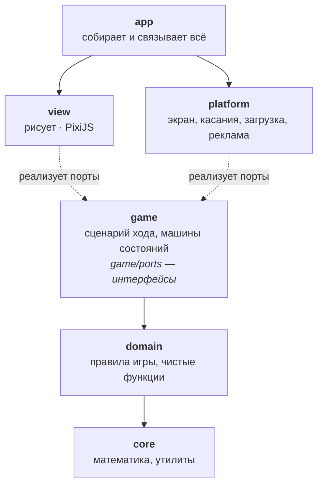
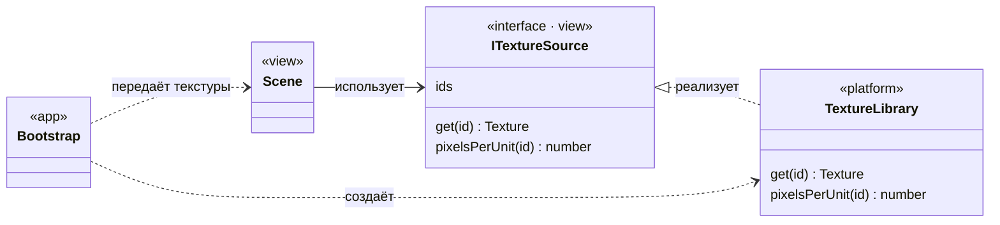
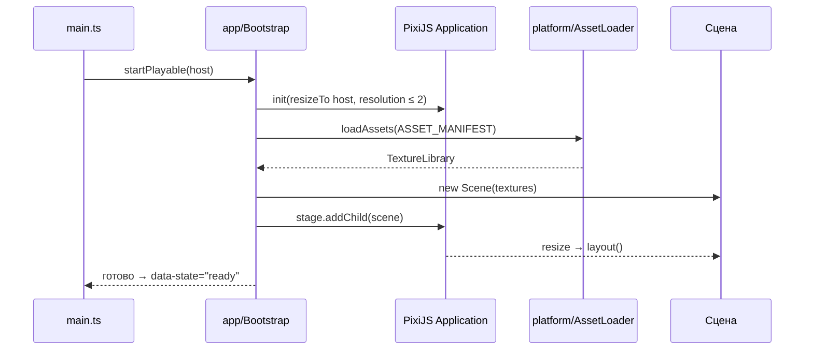
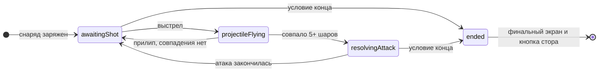
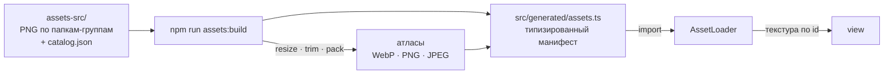
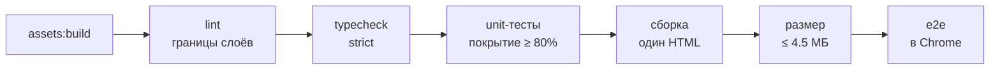

# Bubble Playable

Рекламный playable в жанре bubble shooter на **TypeScript + PixiJS 8**. Результат сборки — **один файл `index.html`** до 4.5 МБ, который загружается в рекламные сети.

> Арт и шрифт (`assets-src/`) принадлежат третьим лицам и в репозиторий не входят. Без этой папки код можно читать, но собрать игру нельзя.

| Этап | Что делается | Статус |
|---|---|---|
| P0 | Каркас, пайплайн ассетов, проверки | ✅ |
| P1 | Правила игры без графики: сетка, совпадения, физика снаряда | ✅ |
| P2 | Сцена и вёрстка под любой экран | ⏳ |
| P3 | Поле с шарами | |
| P4 | Рогатка, выстрел, полёт, прилипание | |
| P5 | Атака: шары летят в орб, орб во врага, эффекты | |
| P6 | Рекламные сети, финальный экран, сборки | |
| P7 | Производительность, QA | |

---

## Архитектура

### Слои

Код разделён на слои. **Слой может зависеть только от слоёв ниже себя.** Правила игры ничего не знают о PixiJS, а графика ничего не решает.



Стрелки показывают ближайшего соседа. Каждый слой может использовать и всё, что лежит ниже по схеме, но никогда то, что выше:

| Слой | Знает о | Не знает о |
|---|---|---|
| `core` | — | всём остальном, PixiJS, браузере |
| `domain` | `core` | `game`, `view`, `platform`, PixiJS, браузере |
| `game` | `domain`, `core` | `view`, `platform`, PixiJS, браузере |
| `view` | `game/ports`, `domain`, `core`, PixiJS | `platform`, `app` |
| `platform` | `game/ports`, `core`, браузер | `view`, `app`, PixiJS (кроме загрузки ассетов) |
| `app` | всё | — |

**Как это удерживается в чистоте.** Таблица выше — не договорённость, а проверка. Собственное ESLint-правило `layers/dependency-direction` ([tools/eslint/layer-rule.js](tools/eslint/layer-rule.js)) роняет `npm run verify` при любом импорте не в ту сторону. В `core`, `domain` и `game` дополнительно запрещены глобальные объекты браузера (`window`, `document`, `fetch`, `setTimeout`…) и `async`/`await`: логика игры — это явные машины состояний, которые обновляются каждый кадр.

### Порты и адаптеры

Если слою нужно что-то от соседа, он не импортирует его, а **объявляет интерфейс** (порт). Сосед реализует интерфейс, а `app` их связывает. Так зависимости всегда идут в одну сторону, а любую часть можно подменить в тестах.



### Запуск



### Ход игры (будет в P4–P5)

Каждая система — явная машина состояний. Данные живут внутри состояния, которому они нужны, поэтому невозможные сочетания нельзя даже записать в коде. Системы не знают друг о друге: ход ведёт посредник `TurnFlow`.



### Структура

```
src/
├─ main.ts            точка входа
├─ app/               composition root: создаёт объекты и связывает слои
├─ core/              математика, события, случайные числа          (P1)
├─ domain/            правила игры: сетка, совпадения, физика        (P1)
├─ game/              системы, машины состояний, порты               (P1+)
├─ view/              всё, что рисует
├─ platform/          экран, касания, загрузка ассетов, реклама
├─ dev/               dev-страницы, в сборку не попадают
└─ generated/         создаётся сборкой ассетов, не редактировать
tools/
├─ assets/            сборка атласов и манифеста
├─ size/              бюджет размера
└─ eslint/            правило направлений зависимостей
tests/
├─ unit/              Vitest
└─ e2e/               Playwright
```

---

## Ассеты



**Папка картинки — это её группа**, а группа решает, как картинка попадёт в игру. Правила лежат в [tools/assets/rules.ts](tools/assets/rules.ts):

| Папка | Куда идёт | Масштаб | Формат |
|---|---|---|---|
| `hero/`, `enemy/` | свой атлас, обрезка прозрачных полей | 0.4 | WebP |
| `bubbles/` | атлас, обрезка прозрачных полей | 0.5 (тела, тень, обводка — 0.4) | WebP |
| `ui/` | атлас | 1 (нижняя панель — 0.5) | WebP |
| `frame/`, `vfx/` | свои атласы | 0.45 / 1 | PNG с палитрой |
| `single/` | отдельный файл | 1 | JPEG |

- `pixelsPerUnit` пересчитывается при уменьшении, поэтому размер картинки в игровом мире не меняется.
- Ассеты импортируются как модули: в dev их отдаёт Vite, в сборке они встраиваются в `index.html`. Внешних запросов у playable нет.
- Папка без правила ломает сборку: решение «что и как везём» всегда явное.

**Добавить картинку:** положить PNG в `assets-src/<группа>/`, добавить запись в `assets-src/catalog.json` (`id`, `file`, `width`, `height`, `pixelsPerUnit`, `anchor`, `borders`) и запустить `npm run assets:build`. Картинка доступна в коде по `id`.

---

## Качество



`npm run verify` запускает всю цепочку. Любой красный шаг останавливает её.

| Уровень | Чем | Что проверяет |
|---|---|---|
| Unit | Vitest | правила игры, математика, инструменты сборки; без браузера, за секунды |
| E2E | Playwright | собранный `index.html` стартует без ошибок, рисует сцену, не ходит в сеть; на телефоне и в ландшафте |
| Статика | TypeScript strict, ESLint | типы, границы слоёв, запреты для чистых слоёв, размер функций и файлов |
| Размер | `npm run size` | один файл и не больше 4.5 МБ |

---

## Быстрый старт

```bash
npm install
```

```bash
npm run assets:build
```

```bash
npm run dev
```

- Игра: <http://localhost:5173>
- Галерея всех спрайтов: <http://localhost:5173/dev/assets.html>
- С телефона в той же Wi-Fi сети: адрес `Network:` из вывода `npm run dev`
- В dev-режиме сцену можно смотреть расширением **PixiJS DevTools** для Chrome

| Команда | Что делает |
|---|---|
| `npm run dev` | dev-сервер с мгновенной перезагрузкой |
| `npm run assets:build` | `assets-src/` → атласы и манифест |
| `npm run build` | typecheck + сборка в один `dist/index.html` |
| `npm run verify` | все проверки по порядку |
| `npm run test` / `test:watch` | unit-тесты |
| `npm run coverage` | unit-тесты с порогом покрытия |
| `npm run e2e` | e2e-тесты собранного билда |
| `npm run size` | проверка бюджета размера |

---

## Конвенции

- `interface` с префиксом `I` описывает поведение (контракт), `type` описывает данные.
- Состояния — размеченные объединения (`{ kind: 'aiming', pull }`), а не наборы флагов.
- Данные неизменяемые: операции возвращают новые объекты. Объекты PixiJS меняются только внутри `view`.
- Никакого глобального состояния и синглтонов: всё передаётся через конструктор.
- Приватные поля `_camelCase`, константы `UPPER_SNAKE_CASE`, булевы значения с `is` / `has` / `can`.
- Комментарии только к публичным контрактам и для неочевидного «почему».
- Функция до 50 строк, файл до 400.

---

## Лицензия

Все права защищены. Репозиторий открыт только для просмотра: использовать, копировать, изменять и распространять код нельзя. Подробности — в [LICENSE](LICENSE).
